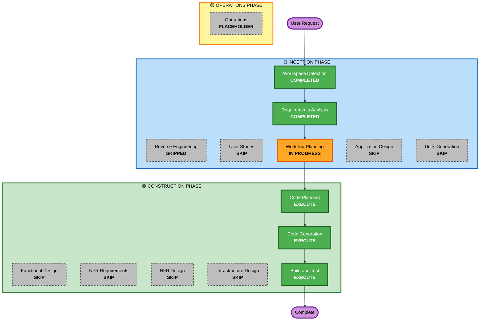

# Execution Plan - Tetris Game Project

## Detailed Analysis Summary

### Change Impact Assessment
- **User-facing changes**: Yes - Complete new game with rich UI, multiple modes, themes, and interactive features
- **Structural changes**: No - Single-component web application (no architectural complexity)
- **Data model changes**: Yes - Game state, scores, achievements, player preferences (all client-side localStorage)
- **API changes**: No - No backend APIs (fully client-side application)
- **NFR impact**: Yes - Performance (60 FPS), audio system, responsive design, browser compatibility

### Risk Assessment
- **Risk Level**: Medium
- **Rollback Complexity**: Easy (static files, no backend dependencies)
- **Testing Complexity**: Moderate (game logic, UI interactions, multiple browsers/devices)
- **Rationale**: Single-component game with well-defined requirements, but complex feature set requires careful implementation and testing

## Workflow Visualization

## Phases to Execute

### 🔵 INCEPTION PHASE
- [x] Workspace Detection (COMPLETED)
- [x] Reverse Engineering (SKIPPED - Greenfield project)
- [x] Requirements Analysis (COMPLETED)
- [x] User Stories (COMPLETED)
- [x] Workflow Planning (IN PROGRESS)
- [ ] Application Design - SKIP
  - **Rationale**: Single-component game application with straightforward structure. No need for high-level component design - implementation details will be handled directly in Code Planning.
- [ ] Units Generation - SKIP
  - **Rationale**: Single unit of work (one game application). No decomposition needed.

### 🟢 CONSTRUCTION PHASE
- [ ] Functional Design - SKIP
  - **Rationale**: Game logic is well-defined in requirements. Direct implementation in code is more efficient than separate design phase.
- [ ] NFR Requirements - SKIP
  - **Rationale**: NFR requirements already captured in requirements document (performance, audio, responsive design, browser compatibility). Tech stack is predetermined (HTML5, Canvas, Web Audio API).
- [ ] NFR Design - SKIP
  - **Rationale**: No complex NFR patterns needed. Standard web game architecture with Canvas rendering and event handling.
- [ ] Infrastructure Design - SKIP
  - **Rationale**: Static web application with no infrastructure requirements. Deployment is simple file hosting.
- [ ] Code Planning - EXECUTE (ALWAYS)
  - **Rationale**: Need detailed implementation plan for complex game with multiple features (game modes, power-ups, achievements, themes, multiplayer).
- [ ] Code Generation - EXECUTE (ALWAYS)
  - **Rationale**: Generate complete game implementation with all features.
- [ ] Build and Test - EXECUTE (ALWAYS)
  - **Rationale**: Comprehensive testing needed for game logic, UI interactions, and cross-browser compatibility.

### 🟡 OPERATIONS PHASE
- [ ] Operations - PLACEHOLDER
  - **Rationale**: Future deployment and monitoring workflows

## Estimated Timeline
- **Total Stages to Execute**: 3 (Code Planning, Code Generation, Build and Test)
- **Estimated Duration**: 2-3 hours for complete implementation
- **Complexity Factors**: 
  - Multiple game modes (Marathon, Sprint, Ultra)
  - Power-ups system with 5 different types
  - Achievements tracking
  - Theme system with 5 themes
  - Audio system (music + sound effects)
  - Responsive design for multiple devices

## Success Criteria
- **Primary Goal**: Fully functional, polished Tetris game with all requested features
- **Key Deliverables**:
  - Complete game implementation (HTML, CSS, JavaScript)
  - All game modes working (Marathon, Sprint, Ultra)
  - Power-ups system functional
  - Achievements tracking and display
  - Theme switching capability
  - Audio system with music and sound effects
  - Responsive design for desktop/tablet/mobile
  - localStorage persistence for scores and preferences
  - Comprehensive testing instructions
- **Quality Gates**:
  - Smooth 60 FPS gameplay
  - All controls responsive (<50ms lag)
  - Cross-browser compatibility verified
  - Mobile responsiveness tested
  - All features working as specified in requirements

## Implementation Approach

### Code Structure
- **Single-page application** in `tetris/` directory
- **File organization**:
  - `index.html` - Main game page
  - `game.js` - Core game logic and state management
  - `renderer.js` - Canvas rendering and visual effects
  - `audio.js` - Audio system (music and sound effects)
  - `storage.js` - localStorage management
  - `ui.js` - UI components and menus
  - `styles.css` - Styling and themes
  - `assets/` - Images, audio files, fonts

### Development Strategy
- **Modular architecture**: Separate concerns (game logic, rendering, audio, UI)
- **Progressive enhancement**: Core gameplay first, then add features
- **Testing checkpoints**: Verify each major feature before proceeding
- **Performance optimization**: Efficient rendering and event handling

## Next Steps
1. **Code Planning**: Create detailed implementation plan with step-by-step tasks
2. **Code Generation**: Implement all features according to plan
3. **Build and Test**: Comprehensive testing and verification
